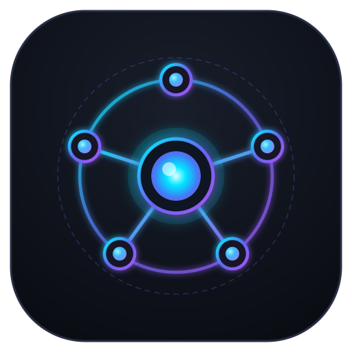

<p align="center">
  
</p>

<h1 align="center">amux (<code>am</code>)</h1>

<p align="center">
  <b>AI Account Multiplexer & Local Failover Gateway</b><br>
  Tự động xoay vòng tài khoản Claude Code chống Rate Limit & Cổng AI Gateway chuẩn OpenAI đa nhà cung cấp.
</p>

<p align="center">
  <a href="#-tính-năng-cốt-lõi">Tính Năng</a> •
  <a href="#-cài-đặt-nhanh">Cài Đặt</a> •
  <a href="#-danh-sách-lệnh-cli-amux--am">Lệnh CLI</a> •
  <a href="#-local-ai-gateway-http1270018787">AI Gateway</a> •
  <a href="#️-cấu-hình-provider-pool-amaccountsjson">Provider Pool</a> •
  <a href="STRUCT.md">Kiến Trúc</a>
</p>

---

## ⚡ Tính Năng Cốt Lõi

- 🔄 **Auto-Rotate Claude Accounts:** Tự động phát hiện và xoay vòng qua nhiều tài khoản Claude Pro / Max trước khi chạm rate limit (dựa vào header `anthropic-ratelimit-*`), tự động refresh token OAuth.
- 🌐 **Local AI Gateway (`:8787`):** Cung cấp endpoint chuẩn OpenAI (`http://127.0.0.1:8787/v1`) tương thích với Cursor, Continue, Cline, LangChain, SDK Python, Node.js...
- 🛡️ **Multi-Provider Failover:** Tự động chuyển mạch dự phòng tức thì khi gặp lỗi 429 giữa các nhà cung cấp (GitHub Models, Gemini API, Groq, DuckDuckGo, Web Sessions) với cơ chế cooldown 30 phút.
- 🧠 **Context & Session Retention:** Giữ nguyên lịch sử hội thoại khi chuyển đổi tài khoản hoặc failover giữa các provider.
- 📊 **Token Usage Analytics:** Đo lường chi tiết lượng token theo ngày, project, model và session kết nối.
- 🔐 **Bảo Mật Cao:** Tích hợp macOS Keychain và mã hóa AES-256-GCM / Scrypt để bảo vệ thông tin đăng nhập và token.

---

## 🚀 Cài Đặt Nhanh

### 1. Cài đặt tự động (macOS):
```sh
curl -fsSL https://raw.githubusercontent.com/ninhlee99/ai-cli-accounts/main/install.sh | sh
```
> *Yêu cầu: macOS, Go 1.22+ và Git. Script sẽ cài đặt song song cả 2 lệnh alias **`amux`** và **`am`** vào `/usr/local/bin` (bạn gõ lệnh nào cũng được).*

### 2. Sử dụng ngay với Claude Code:
1. Mở terminal và chạy `claude` — tài khoản hiện tại sẽ được tự động snapshot vào hệ thống.
2. Để thêm tài khoản mới: gõ `/login` trong Claude Code, sau đó mở một tab terminal mới — hệ thống sẽ tự phát hiện và thêm tài khoản vào danh sách xoay vòng.

* **Nâng cấp:** Chạy lại lệnh cài đặt bên trên.
* **Gỡ cài đặt:** `am hook uninstall && rm -f /usr/local/bin/am /usr/local/bin/amux`

---

## 📋 Danh Sách Lệnh CLI (`amux` / `am`)

> 💡 **Mẹo:** Bạn có thể dùng `amux` hoặc `am` thay thế cho nhau (ví dụ: `amux sw` tương đương `am sw`).

### Quản Lý Tài Khoản & Profile
| Lệnh | Mô Tả |
| :--- | :--- |
| `am ls` | Liệt kê các profile, email và trạng thái đang active |
| `am sw` / `am sw <tên>` | Menu mũi tên tương tác đổi profile hoặc provider |
| `am add [tên]` | Lưu tài khoản CLI hiện tại thành một profile mới |
| `am current` | Kiểm tra tài khoản đang đăng nhập trên hệ thống |
| `am rename <cũ> <mới>` | Đổi tên profile |
| `am rm <tên>` / `am restore <tên>` | Xoá profile vào thùng rác / Khôi phục lại |

### Gateway & AI Provider
| Lệnh | Mô Tả |
| :--- | :--- |
| `am accounts` | Xem danh sách AI Provider trong pool và độ ưu tiên |
| `am login [provider]` | Đăng nhập tương tác Web/API (`chatgpt`, `claude`, `gemini`, `github`, `groq`) |
| `am api add <tên> --endpoint <url> --api-key <key>` | Thêm endpoint chuẩn OpenAI tùy chỉnh vào pool |
| `am api rm <tên>` / `am api ls` | Xoá hoặc xem danh sách provider API tùy chỉnh |
| `am chat [nội dung]` | REPL chat trực tiếp trên terminal với cơ chế auto-failover |

### Giám Sát & Tiện Ích
| Lệnh | Mô Tả |
| :--- | :--- |
| `am status` | Xem trạng thái proxy daemon, các tab đang kết nối và quota |
| `am usage [day\|week\|month]` | Thống kê số lượng token sử dụng (thêm `-D` để xem chi tiết) |
| `am proxy [up\|down]` | Khởi động hoặc dừng proxy daemon chạy nền |
| `am env` | Xuất biến môi trường trỏ vào proxy (`eval "$(am env)"`) |
| `am hook [install\|uninstall]` | Cài đặt hoặc gỡ bỏ Claude Code hook |

---

## 🔌 Local AI Gateway (`http://127.0.0.1:8787`)

Cổng proxy cục bộ hoạt động như một OpenAI-compatible API Gateway với khả năng tự động chuyển mạch (Failover):

### Cursor / Continue / Cline / LangChain
Điền cấu hình trong phần cài đặt hoặc file môi trường:
```env
OPENAI_BASE_URL="http://127.0.0.1:8787/v1"
OPENAI_API_KEY="amux"
```

### Python SDK
```python
from openai import OpenAI

client = OpenAI(
    base_url="http://127.0.0.1:8787/v1",
    api_key="amux"
)

# Hỗ trợ đầy đủ SSE Streaming
stream = client.chat.completions.create(
    model="default",
    messages=[{"role": "user", "content": "Viết thuật toán QuickSort trong Go"}],
    stream=True
)
for chunk in stream:
    if chunk.choices[0].delta.content:
        print(chunk.choices[0].delta.content, end="", flush=True)
```

---

## ⚙️ Cấu Hình Provider Pool (`~/.am/accounts.json`)

Hệ thống ưu tiên gọi các provider theo số thứ tự `priority` từ nhỏ đến lớn. Hỗ trợ bí danh `env:TEN_BIEN` để đọc key từ môi trường:

```json
{
  "providers": [
    {
      "id": "github-models",
      "type": "openai_compatible",
      "priority": 1,
      "baseUrl": "https://models.github.ai/inference",
      "apiKey": "env:GITHUB_MODELS_TOKEN",
      "model": "gpt-4o"
    },
    {
      "id": "google-ai-studio",
      "type": "openai_compatible",
      "priority": 2,
      "baseUrl": "https://generativelanguage.googleapis.com/v1beta/openai",
      "apiKey": "env:GOOGLE_AI_STUDIO_KEY",
      "model": "gemini-2.0-flash"
    },
    {
      "id": "groq",
      "type": "openai_compatible",
      "priority": 3,
      "baseUrl": "https://api.groq.com/openai/v1",
      "apiKey": "env:GROQ_API_KEY",
      "model": "llama-3.3-70b-versatile"
    },
    {
      "id": "duckduckgo",
      "type": "duckduckgo",
      "priority": 4,
      "model": "claude-3-haiku-20240307"
    }
  ]
}
```

---

## 🏛️ Kiến Trúc Hệ Thống

Xem chi tiết thiết kế Domain-Driven Design (DDD), phân tầng các package và sơ đồ luồng dữ liệu tại [STRUCT.md](STRUCT.md).

## 📄 Bản Quyền

Dự án được phát hành theo giấy phép [MIT](LICENSE).
