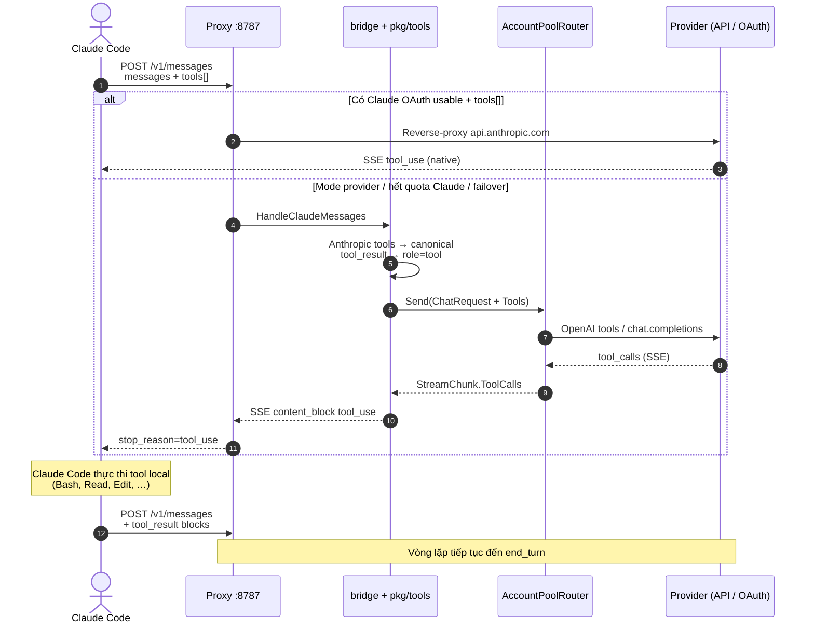

<p align="center">
  
</p>

<h1 align="center">amux (<code>am</code>)</h1>

<p align="center">
  <b>AI Account Multiplexer & Local Failover Gateway</b><br>
  Tự động xoay vòng tài khoản Claude Code chống Rate Limit & Cổng AI Gateway chuẩn OpenAI đa nhà cung cấp.
</p>

<p align="center">
  <a href="#-tính-năng-cốt-lõi">Tính Năng</a> •
  <a href="#-cài-đặt-nhanh">Cài Đặt</a> •
  <a href="#-danh-sách-lệnh-cli-amux--am">Lệnh CLI</a> •
  <a href="#-local-ai-gateway-http1270018787">AI Gateway</a> •
  <a href="#-luồng-claude-code--proxy--tools">Claude Code & Tools</a> •
  <a href="#-amux-watch--dashboard-realtime">Watch</a> •
  <a href="#️-cấu-hình-provider-pool-amaccountsjson">Provider Pool</a> •
  <a href="STRUCT.md">Kiến Trúc</a>
</p>

---

## ⚡ Tính Năng Cốt Lõi

- 🔄 **Auto-Rotate Claude Accounts:** Tự động phát hiện và xoay vòng qua nhiều tài khoản Claude Pro / Max trước khi chạm rate limit (dựa vào header `anthropic-ratelimit-*`), tự động refresh token OAuth.
- 🌐 **Local AI Gateway (`:8787`):** Cung cấp endpoint chuẩn OpenAI (`http://127.0.0.1:8787/v1`) tương thích với Cursor, Continue, Cline, LangChain, SDK Python, Node.js...
- 🧰 **Tool Mid-Layer (`pkg/tools`):** Chuyển đổi tool schema / tool_call giữa Claude Code, Cursor, Codex, Antigravity (Gemini) — Claude Code vẫn nhận `tool_use` và tự thực thi tool local.
- 🛡️ **Multi-Provider Failover:** Tự động chuyển mạch dự phòng tức thì khi gặp lỗi 429 giữa các nhà cung cấp (GitHub Models, Gemini API, Groq, DuckDuckGo, Web Sessions) với cơ chế cooldown 30 phút.
- 🔀 **Pool off/on + `X-Provider`:** `am accounts off|on` đưa account ra/vào rotate; vẫn gọi trực tiếp bằng header `X-Provider` / `X-Model`.
- 🧠 **Context & Session Retention:** Giữ nguyên lịch sử hội thoại khi chuyển đổi tài khoản hoặc failover giữa các provider.
- 📊 **Token Usage Analytics:** Đo lường chi tiết lượng token theo ngày, project, model và session kết nối.
- 🧼 **Privacy scrub (`pkg/privacy`):** Redact email / API key / webhook / card… trên payload outbound trước khi lên upstream.
- 🔐 **Bảo Mật Cao:** Tích hợp macOS Keychain và mã hóa AES-256-GCM / Scrypt để bảo vệ thông tin đăng nhập và token.

---

## 🚀 Cài Đặt Nhanh

### 1. Cài đặt tự động (macOS):
```sh
curl -fsSL https://raw.githubusercontent.com/ninhlee99/amux/main/install.sh | sh
```
> *Yêu cầu: macOS, Go 1.22+ và Git. Script sẽ cài đặt song song cả 2 lệnh alias **`amux`** và **`am`** vào `/usr/local/bin` (bạn gõ lệnh nào cũng được).*

### 2. Sử dụng ngay với Claude Code:
1. Mở terminal và chạy `claude` — tài khoản hiện tại sẽ được tự động snapshot vào hệ thống.
2. Để thêm tài khoản mới: gõ `/login` trong Claude Code, sau đó mở một tab terminal mới — hệ thống sẽ tự phát hiện và thêm tài khoản vào danh sách xoay vòng.

* **Tự động cập nhật:** `am setup --auto-update` (tự động kiểm tra và nâng cấp khi có bản mới)
* **Nâng cấp thủ công:** `am update` (hoặc chạy lại lệnh cài đặt bên trên).
* **Gỡ cài đặt:** `am hook uninstall && rm -f /usr/local/bin/am /usr/local/bin/amux ~/.local/bin/am ~/.local/bin/amux`

---

## 📋 Danh Sách Lệnh CLI (`amux` / `am`)

> 💡 **Mẹo:** Bạn có thể dùng `amux` hoặc `am` thay thế cho nhau (ví dụ: `amux sw` tương đương `am sw`).

### Quản Lý Tài Khoản & Profile
| Lệnh | Mô Tả |
| :--- | :--- |
| `am ls` | Liệt kê các profile, email và trạng thái đang active |
| `am sw` / `am sw <tên>` | Menu mũi tên tương tác đổi profile hoặc provider |
| `am add [tên]` | Lưu tài khoản CLI hiện tại thành một profile mới |
| `am current` | Kiểm tra tài khoản đang đăng nhập trên hệ thống |
| `am rename <cũ> <mới>` | Đổi tên profile |
| `am rm <tên>` / `am restore <tên>` | Xoá profile vào thùng rác / Khôi phục lại |

### Gateway & AI Provider
| Lệnh | Mô Tả |
| :--- | :--- |
| `am accounts` | Xem danh sách AI Provider trong pool và độ ưu tiên |
| `am accounts off\|on <id>` / `am off\|on <id>` | Ra/vào rotate pool (vẫn gọi được qua `X-Provider`) |
| `am login [provider]` | Đăng nhập tương tác Web/API (`chatgpt`, `claude`, `gemini`, `github`, `groq`) |
| `am api add <tên> --endpoint <url> --api-key <key>` | Thêm endpoint chuẩn OpenAI tùy chỉnh vào pool |
| `am api rm <tên>` / `am api ls` | Xoá hoặc xem danh sách provider API tùy chỉnh |
| `am chat [nội dung]` | REPL chat trực tiếp trên terminal với cơ chế auto-failover |

### Giám Sát & Tiện Ích
| Lệnh | Mô Tả |
| :--- | :--- |
| `am setup [--auto-update]` | Cài đặt Claude hook, slash command & kích hoạt tự động cập nhật |
| `am update` | Nâng cấp amux lên bản mới nhất từ GitHub (giữ nguyên toàn bộ tài khoản) |
| `am status` | Xem trạng thái proxy daemon, auto-update, các tab kết nối và quota |
| `am watch` | Dashboard TUI: Dash · Accounts (nhóm) · Activity · Usage |
| `am usage [day\|week\|month]` | Thống kê số lượng token sử dụng (thêm `-D` để xem chi tiết) |
| `am proxy [up\|down]` | Khởi động hoặc dừng proxy daemon chạy nền |
| `am env` | Xuất biến môi trường trỏ vào proxy (`eval "$(am env)"`) |
| `am hook [install\|uninstall]` | Cài đặt hoặc gỡ bỏ Claude Code hook |

---

## 🔌 Local AI Gateway (`http://127.0.0.1:8787`)

Cổng proxy cục bộ hoạt động như một OpenAI-compatible API Gateway với khả năng tự động chuyển mạch (Failover):

### Cursor / Continue / Cline / LangChain
Điền cấu hình trong phần cài đặt hoặc file môi trường:
```env
OPENAI_BASE_URL="http://127.0.0.1:8787/v1"
OPENAI_API_KEY="amux"
```

### Python SDK
```python
from openai import OpenAI

client = OpenAI(
    base_url="http://127.0.0.1:8787/v1",
    api_key="amux"
)

# Hỗ trợ đầy đủ SSE Streaming
stream = client.chat.completions.create(
    model="default",
    messages=[{"role": "user", "content": "Viết thuật toán QuickSort trong Go"}],
    stream=True
)
for chunk in stream:
    if chunk.choices[0].delta.content:
        print(chunk.choices[0].delta.content, end="", flush=True)
```

---

## 🧰 Luồng Claude Code ↔ Proxy ↔ Tools

Claude Code **không** chạy tool trên server amux. Client sở hữu Bash/Read/Edit…; proxy chỉ cần trả đúng khối `tool_use` (Anthropic) hoặc `tool_calls` (OpenAI) để agent loop tiếp tục.

### Ai nói ngôn ngữ nào?

| Client | Endpoint proxy | Tool wire format |
| :--- | :--- | :--- |
| **Claude Code** | `POST /v1/messages` | Anthropic `tools[]` + `tool_use` / `tool_result` |
| **Cursor / Codex** | `POST /v1/chat/completions` | OpenAI `tools[].function` + `tool_calls` |
| **Antigravity** (Gemini-shaped) | qua converter | Gemini `functionDeclarations` / `functionCall` |

Lớp giữa `pkg/tools` (`claude.go` / `cursor.go` / `codex.go` / `gemini.go`) chuẩn hoá mọi thứ về `types.ChatRequest`, rồi adapter pool nói đúng format upstream. Helper chung nằm ở `pkg/utils`.

### Sơ đồ luồng (Claude Code + tools)



### Vai trò từng lớp

1. **Claude Code (client)** — gửi transcript + `tools[]`; nhận `tool_use`; chạy tool trên máy; gửi lại `tool_result`.
2. **Proxy (`pkg/proxy`)** — cổng `127.0.0.1:8787`; quyết định reverse-proxy Anthropic **hoặc** vào provider pool.
3. **Bridge (`pkg/bridge`)** — Anthropic ↔ canonical ↔ OpenAI response SSE/JSON.
4. **`pkg/tools`** — `claude.go` / `cursor.go` / `codex.go` / `gemini.go` (wire format từng client); phần chung ở `pkg/utils`.
5. **Pool + adapters (`pkg/router`, `pkg/provider`)** — failover theo priority; OpenAI-compatible adapter gửi `tools` thật và gom `tool_calls` từ SSE.

### Gắn Claude Code vào proxy

```sh
am proxy up
eval "$(am env)"   # ANTHROPIC_BASE_URL=http://127.0.0.1:8787 …
claude             # hoặc: am run claude
```

Hook SessionStart/End (`am hook install`) cũng bật/tắt proxy khi mở tab Claude Code. `am proxy up`/`am proxy down` tự đồng bộ 3 nơi cùng lúc để Claude Code luôn trỏ đúng, không cần user tự nhớ chạy lại `eval`:

1. **`~/.claude/settings.json` (`env` block)** — Claude Code đọc field này mỗi khi mở **phiên mới**; đây là cách đáng tin cậy nhất vì không phụ thuộc shell.
2. **`launchctl setenv`/`unsetenv`** (macOS) — cho app GUI (IDE, editor) không kế thừa shell rc.
3. **Shell rc (`eval "$(am env)"`)** — cho terminal đã mở sẵn khi chạy lại `am env` thủ công.

Khi `am proxy down` tắt hẳn daemon, cả 3 nơi trên đều được dọn sạch (`unset`, không chỉ "omit") — phiên Claude Code mới mở sau đó tự rơi về `api.anthropic.com` bằng subscription/API key sẵn có, không bị kẹt trỏ vào cổng proxy đã chết. **Lưu ý:** một session đang chạy dở từ trước khi đổi trạng thái proxy sẽ không tự thấy thay đổi (giới hạn vốn có của mọi set-env-at-start) — cần mở phiên mới hoặc `eval "$(am env)"` lại trong session đó.

**Thứ tự ưu tiên khi proxy đang bật:** nếu account Claude subscription hiện tại còn dùng được (chưa bị `am accounts off`, chưa hết rate-limit), proxy ưu tiên reverse-proxy thẳng request Claude Code tới Anthropic bằng chính subscription đó — pool (`chatgpt`, `claude:web`, `gemini:web`, …) chỉ được dùng làm **failover** khi mọi account Claude không dùng được, hoặc khi ép rõ bằng `X-Provider`/`am sw <provider>`. Một account đã `am accounts off` không bao giờ được chọn — dù qua auto-rotate hay `X-Provider` trỏ thẳng ID.

### Cursor / Codex (cùng mid-layer)

```env
OPENAI_BASE_URL="http://127.0.0.1:8787/v1"
OPENAI_API_KEY="amux"
```

Cursor/Codex gửi OpenAI `tools` → `pkg/tools` → pool → trả `tool_calls` đúng dialect. Agent loop vẫn chạy phía client.

> **Lưu ý:** Backend web (Claude/ChatGPT cookie) flatten transcript thành text — không có native tool loop. Agent tool đầy đủ cần Anthropic OAuth reverse-proxy hoặc provider OpenAI-compatible trong pool.

---

## 📺 `amux watch` — Dashboard realtime

TUI Bubble Tea + Lip Gloss (Tokyo Night, rounded panels) — layout theo prototype `amux-go`:

Tabs: **Dash · Accounts (grouped) · Activity (logs+requests) · Usage**

- Accounts nhóm: CLAUDE CODE / CLAUDE WEB / CODEX / CHATGPT / GEMINI… / API (OpenRouter, OpenAI, …)
- Claude hiện **5h + 7d** khi proxy đã nhận rate-limit headers
- `POOL` = trong rotate · `OUT` = chỉ gọi qua `X-Provider` (`am accounts off|on`)
- Usage: `/` filter theo account/model · `p` project · `d/w/m/a` period

Theo dõi gateway trên terminal theo mô hình **overview → detail**:

| Tab | Vai trò | Nội dung |
| :--- | :--- | :--- |
| **1 Dash** | Overview | Proxy KPI, pool in/out, token 7 ngày, activity + request |
| **2 Accounts** | Detail | Nhóm CLAUDE CODE / WEB / CODEX / CHATGPT / GEMINI / API · 5h+7d · POOL/OUT |
| **3 Activity** | Detail | Logs + Requests gộp · filter `/` |
| **4 Usage** | Detail | Token day/week/month/all · filter account/model · project |

```sh
am proxy up          # terminal khác
am watch             # dashboard
```

Phím: `1`–`4` / `Tab` · `/` filter · `d/w/m/a` + `p` (Usage) · `c` clear · `↑↓` · `r` · `q`.

**Rotate:** login mặc định vào pool. `am accounts off <id>` / `am off <claude>` = ra khỏi rotate. Vẫn gọi được:

```http
X-Provider: <account-id>
X-Model: <model>
```

Không header → hành vi cũ. Restart proxy sau khi đổi pool: `am proxy down && am proxy up`.

Log: `~/.am/events.log`, `~/.am/requests.log`.

---

## ⚙️ Cấu Hình Provider Pool (`~/.am/accounts.json`)

Hệ thống ưu tiên gọi các provider theo số thứ tự `priority` từ nhỏ đến lớn. Hỗ trợ bí danh `env:TEN_BIEN` để đọc key từ môi trường:

ID thống nhất `brand[:method]:NN` (vd. `github:api:01`, `gemini:api:01`, `claude:web:01`). Legacy ID tự migrate khi chạy.

```json
{
  "providers": [
    {
      "id": "github:api:01",
      "type": "openai_compatible",
      "priority": 1,
      "baseUrl": "https://models.github.ai/inference",
      "apiKey": "env:GITHUB_MODELS_TOKEN",
      "model": "gpt-4o"
    },
    {
      "id": "gemini:api:01",
      "type": "openai_compatible",
      "priority": 2,
      "baseUrl": "https://generativelanguage.googleapis.com/v1beta/openai",
      "apiKey": "env:GOOGLE_AI_STUDIO_KEY",
      "model": "gemini-3.6-flash"
    },
    {
      "id": "groq:api:01",
      "type": "openai_compatible",
      "priority": 3,
      "baseUrl": "https://api.groq.com/openai/v1",
      "apiKey": "env:GROQ_API_KEY",
      "model": "llama-3.3-70b-versatile"
    },
    {
      "id": "duckduckgo:01",
      "type": "duckduckgo",
      "priority": 4,
      "model": "claude-3-haiku-20240307"
    }
  ]
}
```

---

## 🏛️ Kiến Trúc Hệ Thống

Xem chi tiết thiết kế Domain-Driven Design (DDD), phân tầng các package và sơ đồ luồng dữ liệu tại [STRUCT.md](STRUCT.md).

## 📄 Bản Quyền

Dự án được phát hành theo giấy phép [MIT](LICENSE).
