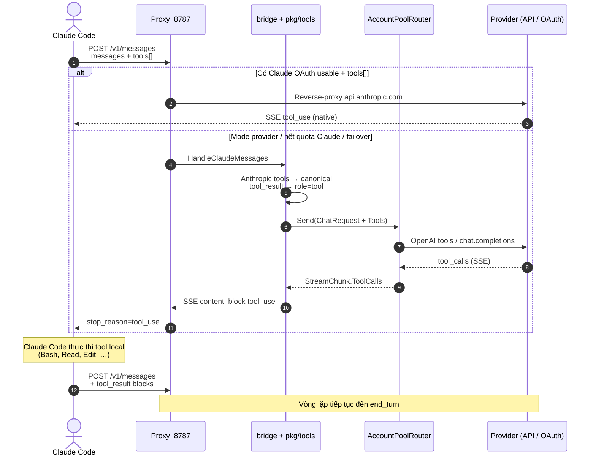

<p align="center">
  
</p>

<h1 align="center">amux (<code>am</code>)</h1>

<p align="center">
  <b>AI Account Multiplexer & Local Failover Gateway</b><br>
  Tự động xoay vòng tài khoản Claude Code chống Rate Limit & Cổng AI Gateway chuẩn OpenAI đa nhà cung cấp.
</p>

<p align="center">
  <a href="#-tính-năng-cốt-lõi">Tính Năng</a> •
  <a href="#-cài-đặt-nhanh">Cài Đặt</a> •
  <a href="#-danh-sách-lệnh-cli-amux--am">Lệnh CLI</a> •
  <a href="#-local-ai-gateway-http1270018787">AI Gateway</a> •
  <a href="#-luồng-claude-code--proxy--tools">Claude Code & Tools</a> •
  <a href="#-amux-watch--dashboard-realtime">Watch</a> •
  <a href="#️-cấu-hình-provider-pool-amaccountsjson">Provider Pool</a> •
  <a href="STRUCT.md">Kiến Trúc</a>
</p>

---

## ⚡ Tính Năng Cốt Lõi

- 🔄 **Auto-Rotate Claude Accounts:** Tự động phát hiện và xoay vòng qua nhiều tài khoản Claude Pro / Max trước khi chạm rate limit (dựa vào header `anthropic-ratelimit-*`), tự động refresh token OAuth.
- 🌐 **Local AI Gateway (`:8787`):** OpenAI (`/v1/chat/completions`, `/v1/models`) + Anthropic (`/v1/messages`) — Cursor, Continue, Cline, LangChain, Claude Code, SDK.
- 🧰 **Tool Mid-Layer (`pkg/tools`):** Chuyển đổi tool schema / tool_call giữa Claude Code, Cursor, Codex, Antigravity (Gemini) — Claude Code vẫn nhận `tool_use` và tự thực thi tool local.
- 🛡️ **Multi-Provider Failover:** Tự động chuyển mạch khi 429 / lỗi auth giữa GitHub Models, Gemini API, Groq, OpenRouter, Codex CLI và Web Sessions (ChatGPT / Claude / Gemini) — cooldown 30 phút.
- 🔀 **Pool + `X-Provider`:** `am off` / `am pool remove` đưa **mọi** account ra rotate; `am on` / `am pool add` đưa vào. `X-Provider` pin thẳng 1 id.
- 🧠 **Context & Session Retention:** Giữ lịch sử hội thoại khi đổi tài khoản hoặc failover provider.
- 📊 **Token Usage Analytics:** Token theo ngày / tuần / tháng, project, model, session.
- 🧼 **Privacy redact (`pkg/privacy`):** Che email / API key / webhook / card… trên payload outbound trước khi lên upstream.
- 🔐 **Bảo mật:** macOS Keychain (OAuth + master key), `accounts.json` mã hóa AES-256-GCM (`AMENC1:`), bundle export/import Scrypt. Bind `--public` bắt API key ephemeral `amux-<auth-token>` (`am proxy token`).
- 🔁 **Env sync khi proxy up/down:** đồng bộ `~/.claude/settings.json` `env`, `launchctl`, và `eval "$(am env)"` (`unset` khi down → fallback `api.anthropic.com`).

---

## 🚀 Cài Đặt Nhanh

### 1. Cài đặt tự động (macOS):
```sh
curl -fsSL https://raw.githubusercontent.com/ninhlee99/amux/main/install.sh | sh
```
> *Yêu cầu: **macOS**, **Go 1.26+**, Git. Script build từ source, cài song song alias **`amux`** và **`am`** vào `~/.local/bin` (ưu tiên nếu nằm trong `PATH`) hoặc `/usr/local/bin`, rồi chạy `am setup` (hook + `/am:feedback`).*

### 2. Sử dụng ngay với Claude Code:
1. Mở `claude` — hook `SessionStart` chạy `am proxy up`. Proxy snapshot tài khoản Claude đang login vào `~/.am/` (cũng có thể `am add` thủ công).
2. Thêm tài khoản: trong Claude Code gõ `/login`, xong `am add` (hoặc mở tab mới — proxy nhận login mới rồi snapshot).
3. Thêm provider pool: `am login chatgpt|claude|gemini|gemini-web|github|groq` hoặc `am api add`.

* **Tự động cập nhật:** `am setup --auto-update` (LaunchAgent, kiểm tra định kỳ).
* **Nâng cấp thủ công:** `am update` (hoặc `--force` để build lại; giữ nguyên `~/.am/`).
* **Gỡ cài đặt:** `am hook uninstall && rm -f /usr/local/bin/am /usr/local/bin/amux ~/.local/bin/am ~/.local/bin/amux`

---

## 📋 Danh Sách Lệnh CLI (`amux` / `am`)

> 💡 **Mẹo:** Bạn có thể dùng `amux` hoặc `am` thay thế cho nhau (ví dụ: `amux sw` tương đương `am sw`).

### Tài khoản
| Lệnh | Mô Tả |
| :--- | :--- |
| `am accounts` | List **mọi** account: Claude + web + API (`POOL=IN/OUT`) |
| `am off <id>` / `am on <id>` | Ra/vào rotate — Claude, web, API (vẫn nằm `am accounts`) |
| `am add [tool] [tên]` | Lưu login CLI hiện tại (`claude` / `codex` / `gemini`) |
| `am rm` / `am restore` | Xoá profile Claude vào thùng rác / khôi phục |
| `am rename <cũ> <mới>` | Đổi tên profile Claude |
| `am sw` / `am sw <id>` | Picker hoặc pin Claude / provider |
| `am ls [tool]` | Chỉ profile CLI (short ID) |
| `am current [tool]` | Ai đang login trên máy |

### Rotate pool
| Lệnh | Mô Tả |
| :--- | :--- |
| `am pool` | Ai đang **IN** rotate |
| `am pool add <id>` | Vào rotate (giống `am on`) |
| `am pool remove <id>` | Ra rotate, **không** xoá list (giống `am off`) |
| `am pool priority <id> <N>` / `am pool model <id> <model>` | Priority / model — hot-reload |
| `am login <provider>` | `chatgpt`, `claude`, `gemini`, `gemini-web`, `github`, `groq` |
| `am api add <tên> --endpoint <url> --api-key <key>` | Thêm OpenAI-compatible |
| `am accounts rm <id>` | Xoá provider khỏi **list** (khác `pool remove`) |
| `am doctor providers` | Probe 1 lượt |
| `am chat [--provider <id>]` | REPL + failover |

Alias cũ: `am accounts off\|on` = `am pool remove\|add`.

> **Codex:** sau `am add codex`, token ChatGPT subscription được tái sử dụng thành adapter `codex:NN` (`type: codex_cli`) — không cần `am login` riêng.

### Giám Sát & Tiện Ích
| Lệnh | Mô Tả |
| :--- | :--- |
| `am setup [--auto-update]` | Hook Claude + slash `/am:feedback` + (tuỳ chọn) auto-update |
| `am update [--force] [--quiet]` | Nâng cấp từ GitHub `main` (giữ `~/.am/`) |
| `am status` | Proxy, quota 5h/7d, pool, số tab |
| `am watch` | Dashboard TUI: Dash · Accounts · Activity · Usage |
| `am usage [day\|week\|month\|all]` | Token (`-D` chi tiết, `-d YYYY-MM-DD`, `-p PROJECT`) |
| `am proxy [up\|down\|token]` | Daemon `:8787`. `--public` bind `0.0.0.0`; `-p/--port`; `--threshold N` (mặc định 95). `token` in admin token |
| `am run claude` | Chạy `claude` đã gắn proxy |
| `am env [--public]` | `eval "$(am env)"` — up: export gateway; down: `unset`. `--public` dùng LAN IP. `am env set\|get\|rm\|list` |
| `am hook [install\|uninstall\|status]` | Claude Code hook |
| `am export` / `am import` | Bundle profile mã hóa (`.amexp`) sang máy khác |
| `am feedback` | Mở issue GitHub (`/am:feedback` trong Claude Code) |

---

## 🔌 Local AI Gateway (`http://127.0.0.1:8787`)

Cổng proxy cục bộ: OpenAI-compatible (`/v1/chat/completions`, `/v1/models`) + Anthropic (`/v1/messages`) với failover.

Loopback (`127.0.0.1`) **không** bắt token (chấp nhận dummy key/sample key bất kỳ). Khi bind `--public` (hoặc mở IP ra bên ngoài), proxy tự động phát hành API Key dạng `amux-<auth-token>` (tương tự Antigravity). Client kết nối qua IP public **bắt buộc** phải sử dụng key này (`X-Api-Key`, `Authorization: Bearer <key>`, hoặc `X-Am-Token`), không được dùng key mẫu/dummy. Key này là ephemeral — mỗi lần bật/tắt proxy public sẽ tự động tạo một key mới. Lấy key bằng lệnh `am proxy token`.

### Claude Code
```sh
am proxy up
eval "$(am env)"    # ANTHROPIC_BASE_URL + ANTHROPIC_AUTH_TOKEN=am-proxy
claude              # hoặc: am run claude
```

### Cursor / Continue / Cline / LangChain
```env
OPENAI_BASE_URL="http://127.0.0.1:8787/v1"
OPENAI_API_KEY="am-proxy"
```

### Antigravity / Gemini CLI / Google Gen AI SDK
```env
GEMINI_API_BASE="http://127.0.0.1:8787"
GOOGLE_GENAI_BASE_URL="http://127.0.0.1:8787"
```

Ép 1 provider / model (không đi rotate):

```http
X-Provider: gemini:api:01
X-Model: gemini-3.6-flash
```

### Python SDK
```python
from openai import OpenAI

client = OpenAI(
    base_url="http://127.0.0.1:8787/v1",
    api_key="am-proxy",
)

# Hỗ trợ đầy đủ SSE Streaming
stream = client.chat.completions.create(
    model="default",
    messages=[{"role": "user", "content": "Viết thuật toán QuickSort trong Go"}],
    stream=True
)
for chunk in stream:
    if chunk.choices[0].delta.content:
        print(chunk.choices[0].delta.content, end="", flush=True)
```

---

## 🧰 Luồng Claude Code ↔ Proxy ↔ Tools

Claude Code, Cursor, Antigravity **không** chạy tool trên server amux. Client sở hữu Bash/Read/Edit…; proxy chỉ cần trả đúng khối `tool_use` (Anthropic), `tool_calls` (OpenAI), hoặc `functionCall` (Gemini) để agent loop tiếp tục.

### Ai nói ngôn ngữ nào?

| Client | Endpoint proxy | Tool wire format |
| :--- | :--- | :--- |
| **Claude Code** | `POST /v1/messages` | Anthropic `tools[]` + `tool_use` / `tool_result` |
| **Cursor / Codex** | `POST /v1/chat/completions` | OpenAI `tools[].function` + `tool_calls` |
| **Antigravity** (Google GenAI) | `POST /v1beta/models/...:generateContent` & `:streamGenerateContent` | Gemini `functionDeclarations` / `functionCall` |

Lớp giữa `pkg/tools` (`claude.go` / `cursor.go` / `codex.go` / `gemini.go`) chuẩn hoá mọi thứ về `types.ChatRequest`, rồi adapter pool nói đúng format upstream. Helper chung nằm ở `pkg/utils`.

### Sơ đồ luồng (Claude Code + tools)



### Vai trò từng lớp

1. **Claude Code (client)** — gửi transcript + `tools[]`; nhận `tool_use`; chạy tool trên máy; gửi lại `tool_result`.
2. **Proxy (`pkg/proxy`)** — cổng `127.0.0.1:8787`; quyết định reverse-proxy Anthropic **hoặc** vào provider pool.
3. **Bridge (`pkg/bridge`)** — Anthropic ↔ canonical ↔ OpenAI response SSE/JSON.
4. **`pkg/tools`** — `claude.go` / `cursor.go` / `codex.go` / `gemini.go` (wire format từng client); phần chung ở `pkg/utils`.
5. **Pool + adapters (`pkg/router`, `pkg/provider`)** — failover theo priority; OpenAI-compatible adapter gửi `tools` thật và gom `tool_calls` từ SSE.

### Gắn Claude Code vào proxy

```sh
am proxy up
eval "$(am env)"   # ANTHROPIC_BASE_URL=http://127.0.0.1:8787 …
claude             # hoặc: am run claude
```

Hook SessionStart/End (`am hook install`) cũng bật/tắt proxy khi mở tab Claude Code. `am proxy up`/`am proxy down` tự đồng bộ 3 nơi cùng lúc để Claude Code luôn trỏ đúng, không cần user tự nhớ chạy lại `eval`:

1. **`~/.claude/settings.json` (`env` block)** — Claude Code đọc field này mỗi khi mở **phiên mới**; đây là cách đáng tin cậy nhất vì không phụ thuộc shell.
2. **`launchctl setenv`/`unsetenv`** (macOS) — cho app GUI (IDE, editor) không kế thừa shell rc.
3. **Shell rc (`eval "$(am env)"`)** — cho terminal đã mở sẵn khi chạy lại `am env` thủ công.

Khi `am proxy down` tắt hẳn daemon, cả 3 nơi trên đều được dọn sạch (`unset`, không chỉ "omit") — phiên Claude Code mới mở sau đó tự rơi về `api.anthropic.com` bằng subscription/API key sẵn có, không bị kẹt trỏ vào cổng proxy đã chết. **Lưu ý:** một session đang chạy dở từ trước khi đổi trạng thái proxy sẽ không tự thấy thay đổi (giới hạn vốn có của mọi set-env-at-start) — cần mở phiên mới hoặc `eval "$(am env)"` lại trong session đó.

**Thứ tự ưu tiên khi proxy đang bật:** account Claude subscription còn dùng được (`am off` chưa tắt, chưa hết rate-limit) → reverse-proxy thẳng Anthropic. Pool (`chatgpt`, `claude:web`, `gemini:web`, …) chỉ **failover** khi mọi Claude profile không dùng được, hoặc khi ép `X-Provider` / `am sw <provider>`.

- `am off <profile>` — profile Claude: skip rotate, chặn `am sw` **và** `X-Provider` (không bypass subscription đã tắt).
- `am accounts off <id>` — provider pool: ra khỏi failover rotate; **vẫn** gọi được bằng `X-Provider` / `X-Model`.

### Cursor / Codex (cùng mid-layer)

```env
OPENAI_BASE_URL="http://127.0.0.1:8787/v1"
OPENAI_API_KEY="am-proxy"
```

Cursor/Codex gửi OpenAI `tools` → `pkg/tools` → pool → trả `tool_calls` đúng dialect. Agent loop vẫn chạy phía client.

> **Lưu ý:** Backend web (Claude/ChatGPT cookie) flatten transcript thành text — không có native tool loop. Agent tool đầy đủ cần Anthropic OAuth reverse-proxy hoặc provider OpenAI-compatible trong pool.

---

## 📺 `amux watch` — Dashboard realtime

TUI Bubble Tea + Lip Gloss (Tokyo Night, rounded panels) — layout theo prototype `amux-go`:

Tabs: **Dash · Accounts (grouped) · Activity (logs+requests) · Usage**

- Accounts nhóm: CLAUDE CODE / CLAUDE WEB / CODEX / CHATGPT / GEMINI… / API (OpenRouter, OpenAI, …)
- Claude hiện **5h + 7d** khi proxy đã nhận rate-limit headers
- `POOL` = trong rotate · `OUT` = chỉ gọi qua `X-Provider` (`am accounts off|on`)
- Usage: `/` filter theo account/model · `p` project · `d/w/m/a` period

Theo dõi gateway trên terminal theo mô hình **overview → detail**:

| Tab | Vai trò | Nội dung |
| :--- | :--- | :--- |
| **1 Dash** | Overview | Proxy KPI, pool in/out, token 7 ngày, activity + request |
| **2 Accounts** | Detail | Nhóm CLAUDE CODE / WEB / CODEX / CHATGPT / GEMINI / API · 5h+7d · POOL/OUT |
| **3 Activity** | Detail | Logs + Requests gộp · filter `/` |
| **4 Usage** | Detail | Token day/week/month/all · filter account/model · project |

```sh
am proxy up          # terminal khác
am watch             # dashboard
```

Phím: `1`–`4` / `Tab` · `/` filter · `d/w/m/a` + `p` (Usage) · `c` clear · `↑↓` · `r` · `q`.

**Rotate:** login mặc định vào pool. `am accounts off <id>` / `am off <claude>` = ra khỏi rotate. Vẫn gọi được:

```http
X-Provider: <account-id>
X-Model: <model>
```

Không header → rotate pool. `am accounts off|on|priority|model` và `am off|on` **hot-reload** qua `/_am/sync` — không cần restart daemon.

Log: `~/.am/events.log`, `~/.am/requests.log`. Dữ liệu hồ sơ / pool: `~/.am/` (giữ nguyên khi `am update`).

---

## ⚙️ Cấu Hình Provider Pool (`~/.am/accounts.json`)

Ưu tiên theo `priority` (số nhỏ thử trước). Key có thể là `env:TEN_BIEN`.

ID: `brand[:method]:NN` (vd. `github:api:01`, `gemini:api:01`, `claude:web:01`). Legacy ID tự migrate khi chạy `am`.

**Không sửa `~/.am/accounts.json` bằng tay** — file trên đĩa được mã hóa AES-256-GCM (magic `AMENC1:`, master key trong Keychain). Thêm/sửa bằng `am login`, `am api add`, `am accounts priority|model|off|on|rm`. Schema plaintext nằm ở [`accounts.example.json`](accounts.example.json):

```json
{
  "providers": [
    {
      "id": "github:api:01",
      "type": "openai_compatible",
      "priority": 1,
      "baseUrl": "https://models.github.ai/inference",
      "apiKey": "env:GITHUB_MODELS_TOKEN",
      "model": "gpt-4o"
    },
    {
      "id": "gemini:api:01",
      "type": "openai_compatible",
      "priority": 2,
      "baseUrl": "https://generativelanguage.googleapis.com/v1beta/openai",
      "apiKey": "env:GOOGLE_AI_STUDIO_KEY",
      "model": "gemini-3.6-flash"
    },
    {
      "id": "groq:api:01",
      "type": "openai_compatible",
      "priority": 3,
      "baseUrl": "https://api.groq.com/openai/v1",
      "apiKey": "env:GROQ_API_KEY",
      "model": "llama-3.3-70b-versatile"
    }
  ]
}
```

### Bind LAN (`--public`)

```sh
am proxy up --public            # 0.0.0.0:<port>
am proxy up --public -p 9000
am proxy token                  # Bearer / X-Am-Token cho máy khác
eval "$(am env --public)"       # BASE_URL = LAN IP
```

Loopback vẫn không cần token. `/_am/status` trên localhost luôn mở.

---

## 🏛️ Kiến Trúc Hệ Thống

Xem chi tiết thiết kế Domain-Driven Design (DDD), phân tầng các package và sơ đồ luồng dữ liệu tại [STRUCT.md](STRUCT.md).

## 📄 Bản Quyền

Dự án được phát hành theo giấy phép [MIT](LICENSE).
