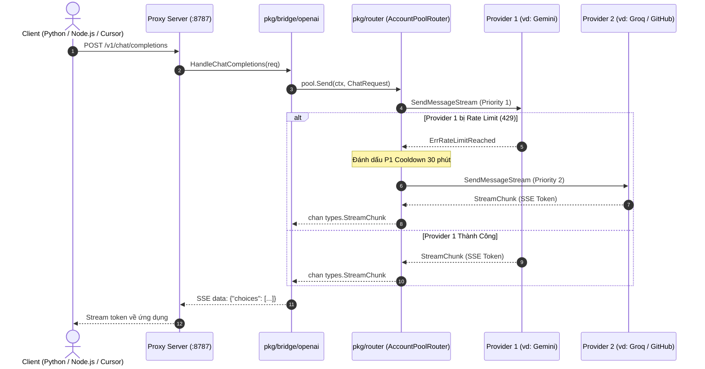
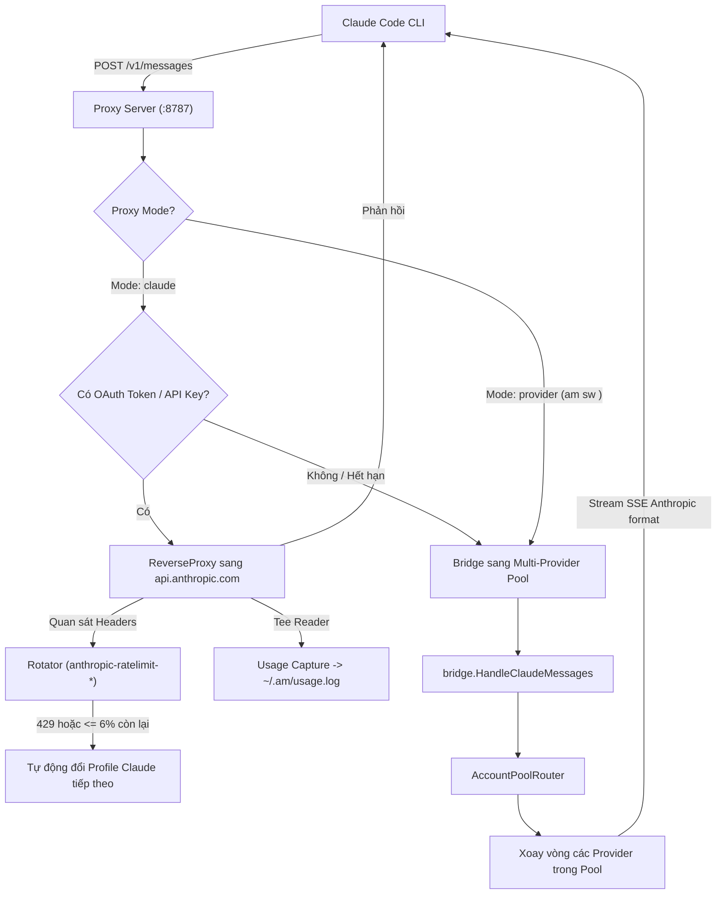

# Kiến Trúc Dự Án `ai-cli-accounts` (STRUCT.md)

Dự án `ai-cli-accounts` (CLI `am`) được thiết kế theo chuẩn kiến trúc dự án Go (**Standard Go Project Layout**), kết hợp các nguyên lý **Domain-Driven Design (DDD)** và **Plugin Architecture**. 

Tài liệu này mô tả chi tiết cấu trúc thư mục, trách nhiệm của từng package, cùng các luồng dữ liệu (Data Flows) cốt lõi của hệ thống.

---

## 1. Sơ Đồ Cây Thư Mục

```
ai-cli-accounts/
├── main.go                         # CLI entrypoint mỏng (11 dòng) — chỉ gọi cli.Run(os.Args)
├── accounts.example.json           # File cấu hình mẫu cho các Provider
├── STRUCT.md                       # Tài liệu tổng quan kiến trúc hệ thống
├── README.md                       # Hướng dẫn sử dụng CLI
│
└── pkg/
    ├── cli/                        # [ENTRYPOINT] Toàn bộ logic dispatch tham số CLI
    │   ├── cli.go                  # Run(args): switch/case cho add, ls, rm, sw, run, usage, proxy, hook, export, import...
    │   └── cli_test.go             # Unit test dispatch & helpers (resolveName, toolAndName...)
    │
    ├── types/                      # [DOMAIN CORE] Entities & Data Contracts dùng chung
    │   ├── chat.go                 # ChatMessage, ChatRequest, StreamChunk, ProviderAdapter interface
    │   ├── profile.go              # ProfileMeta, Artifact, ToolSpec, Token, ProfileEntry
    │   ├── usage.go                # UsageEntry
    │   └── config.go               # BaseDir(), CurrentUser(), ToolConfig
    │
    ├── auth/                       # [AUTH DOMAIN] Quản trị chứng thực & bảo mật
    │   ├── keychain.go             # macOS Keychain CLI wrapper (kcGet, kcSet, kcAccount)
    │   ├── token.go                # Claude OAuth token loader, refresh logic, token persistence
    │   ├── crypto.go               # Master key Keychain & AES-256-GCM encryption/decryption
    │   └── crypto_test.go          # Unit test mã hoá / giải mã
    │
    ├── profile/                    # [PROFILE DOMAIN] Quản lý Snapshot & Switch tài khoản CLI
    │   ├── manager.go              # CRUD Profile, bundle tar.gz encrypted (.amp), .meta.json, .active
    │   ├── transfer.go             # Xuất/nhập profile di động (.amexp) qua Scrypt + AES-256-GCM
    │   └── manager_test.go         # Unit test đóng gói bundle & sanitize name
    │
    ├── provider/                   # [PLUGIN ARCHITECTURE] Các LLM Adapter & Nhà cung cấp
    │   ├── config.go               # Quản lý ~/.am/accounts.json, resolveSecret ("env:...")
    │   ├── stream.go               # Kênh đồng bộ stream SSE an toàn
    │   ├── openai.go               # Universal OpenAI Adapter (GitHub Models, Groq, DeepSeek, Ollama...)
    │   ├── gemini.go               # Google AI Studio / Gemini Adapter
    │   ├── duckduckgo.go           # DuckDuckGo AI Free Fallback Adapter
    │   ├── chatgpt_web.go          # ChatGPT Web Adapter (sessionToken / accessToken)
    │   ├── claude_web.go           # Claude Web Adapter (sessionKey cookie)
    │   └── config_test.go          # Unit test CRUD provider & resolve secrets
    │
    ├── browser/                    # [BROWSER UTILS] Trích xuất Cookie trình duyệt
    │   └── cookies.go              # Giải mã cookie Chromium macOS (Chrome, Edge, Brave, Arc)
    │
    ├── router/                     # [ROUTING DOMAIN] Auto-Rotation & Failover Pool
    │   ├── pool.go                 # AccountPoolRouter (sắp xếp ưu tiên, cooldown 30m khi 429, SetPreferred)
    │   ├── pool_test.go            # Unit test failover khi gặp 429
    │   └── preferred_test.go       # Unit test ghim provider ưu tiên
    │
    ├── bridge/                     # [BRIDGE / GATEWAY] Chuyển đổi giao thức đa chuẩn
    │   ├── openai.go               # Gateway chuẩn OpenAI: /v1/chat/completions (SSE & Non-stream) & /v1/models
    │   ├── claude.go               # Chuyển đổi Anthropic /v1/messages sang ChatRequest & stream SSE
    │   └── claude_test.go          # Unit test bridge messages
    │
    ├── proxy/                      # [PROXY DAEMON] Cổng HTTP Reverse Proxy & Rotator
    │   ├── server.go               # HTTP Server (:8787), middleware withProxy, graceful shutdown
    │   ├── rotator.go              # Bộ xoay vòng Claude OAuth in-memory, theo dõi rate limit 5h/7d
    │   ├── lifecycle.go            # Giám sát vòng đời tiến trình Claude tab qua PID
    │   └── client.go               # Client điều khiển daemon (up, down, switch, sync)
    │
    ├── usage/                      # [METRICS DOMAIN] Đo lường & Thống kê Token
    │   ├── project.go              # Phân giải thư mục dự án của client qua TCP port (lsof)
    │   ├── capture.go              # Tee reader bóc tách token (cả gzip / plain) vào ~/.am/usage.log
    │   ├── usage.go                # Tổng hợp báo cáo usage theo ngày, tuần, tháng, chi tiết
    │   └── usage_test.go           # Unit test báo cáo usage
    │
    ├── hook/                       # [HOOK DOMAIN] Tích hợp với Claude Code CLI
    │   ├── hook.go                 # Cài đặt / gỡ bỏ hooks trong ~/.claude/settings.json
    │   └── feedback.go             # Cài đặt slash command /am:feedback
    │
    ├── env/                        # [ENV DOMAIN] Quản trị biến môi trường Shell
    │   └── env.go                  # Xuất biến ANTHROPIC_BASE_URL cho eval "$(am env)"
    │
    └── ui/                         # [PRESENTATION] Giao diện người dùng Terminal
        ├── picker.go               # Menu mũi tên tương tác chọn Profile Claude hoặc Provider
        ├── chat.go                 # REPL Chat tương tác trực tiếp qua terminal (`am chat`)
        ├── login.go                # Wizard đăng nhập (`am login`, `am accounts`, `am api`)
        └── status.go               # Bảng dashboard theo dõi trạng thái proxy, quota 5h/7d, pool
```

---

## 2. Chi Tiết Trách Nhiệm Các Package

| Package | Tầng Kiến Trúc | Trách Nhiệm Chính |
| :--- | :--- | :--- |
| `main.go` & `pkg/cli` | Entrypoint | `main.go` chỉ gọi `cli.Run(os.Args)`; toàn bộ logic dispatch tham số CLI đến các domain packages nằm trong `pkg/cli/cli.go`. |
| `pkg/types` | Domain Core | Chứa các struct và interface nền tảng (`ChatMessage`, `ChatRequest`, `ProviderAdapter`, `ProfileMeta`...). Không phụ thuộc package nội bộ nào khác. |
| `pkg/auth` | Infrastructure / Auth | Làm việc trực tiếp với macOS Keychain qua `security` CLI; quản lý master key AES-GCM; xử lý gia hạn (refresh) OAuth token của Claude Code. |
| `pkg/profile` | Domain / Profile | Quản lý snapshot các file auth và keychain entry thành file nén mã hoá `.amp`; hỗ trợ sao lưu tự động và phục hồi. |
| `pkg/provider` | Plugin / Providers | Triển khai `ProviderAdapter` cho các nhà cung cấp AI: OpenAI, Google Gemini, Groq, GitHub Models, DuckDuckGo, ChatGPT Web, Claude Web. |
| `pkg/browser` | Infrastructure | Đọc DB SQLite và giải mã cookie an toàn từ các trình duyệt Chromium trên macOS qua PBKDF2/AES. |
| `pkg/router` | Domain / Router | Điều phối request theo thứ tự ưu tiên (`Priority`); tự động cách ly 30 phút (`Cooldown`) nhà cung cấp bị HTTP 429; hỗ trợ ghim provider (`SetPreferred`). |
| `pkg/bridge` | Protocol Bridge | Cầu nối chuyển đổi định dạng 2 chiều giữa Anthropic `/v1/messages` và OpenAI `/v1/chat/completions`. |
| `pkg/proxy` | Server / Gateway | HTTP Proxy Daemon chạy trên `127.0.0.1:8787`, định tuyến thông minh giữa Claude upstream và Multi-Provider pool. |
| `pkg/usage` | Domain / Metrics | Bắt gói tin phản hồi (stream và non-stream) để ghi nhận số token sử dụng theo từng model, project, session; hiển thị bảng thống kê. |
| `pkg/hook` | Integration | Quản lý vòng đời gắn hook vào `~/.claude/settings.json` (tự động bật/tắt proxy khi mở/đóng tab Claude Code). |
| `pkg/env` | Integration | Quản lý file `~/.am/env.json` và in lệnh `export` phục vụ `eval "$(am env)"`. |
| `pkg/ui` | Presentation | Giao diện dòng lệnh: menu điều hướng mũi tên (raw terminal), REPL chat streaming, wizard đăng nhập, bảng trạng thái dashboard. |

---

## 3. Các Luồng Dữ Liệu Cốt Lõi (Core Data Flows)

### Luồng 1: Ứng dụng ngoài gọi vào OpenAI Gateway (`/v1/chat/completions`)

Bất kỳ ứng dụng nào (Python OpenAI SDK, Node.js, Cursor, Continue, LangChain...) trỏ Base URL về `http://127.0.0.1:8787/v1`:



---

### Luồng 2: Claude Code CLI gọi `/v1/messages`

Khi sử dụng lệnh `claude` trên terminal:



---

## 4. Các Nguyên Tắc Thiết Kế Cần Tuân Thủ Khi Mở Rộng

1. **Không vòng lặp phụ thuộc (Zero Circular Dependencies):** `pkg/types` là trung tâm dữ liệu. Các package khác chỉ import `pkg/types` và các package độc lập bên dưới.
2. **Stateless Session Retention:** Khi thêm bất kỳ Provider mới nào trong `pkg/provider/`, phải kế thừa hàm ghép ngữ cảnh `BuildConcatenatedPrompt` để đảm bảo không mất lịch sử khi failover.
3. **Graceful Failover:** Bất kỳ provider nào trả về HTTP 429 hoặc lỗi xác thực phải map chính xác về `types.ErrRateLimitReached` hoặc `types.ErrAuthentication` để `AccountPoolRouter` xử lý cách ly chuẩn xác.
4. **Entrypoint đơn nhất:** Chỉ có một entrypoint (`main.go` ở thư mục gốc, gọi `cli.Run`). Không tạo lại `cmd/am/main.go` — đó là bản sao dư thừa của `main.go`, đã được xoá theo yêu cầu dọn dẹp tính năng dư thừa.
