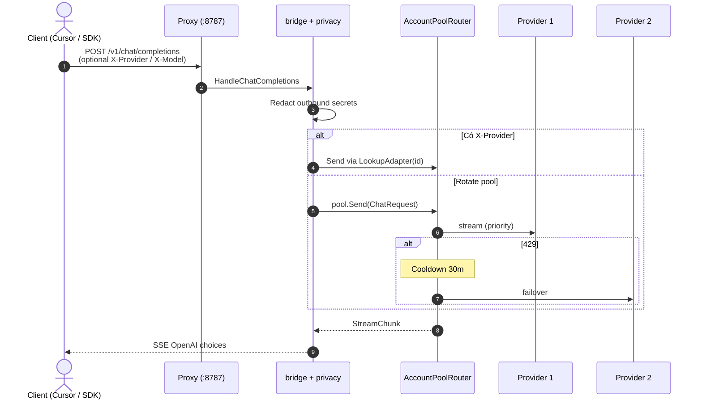
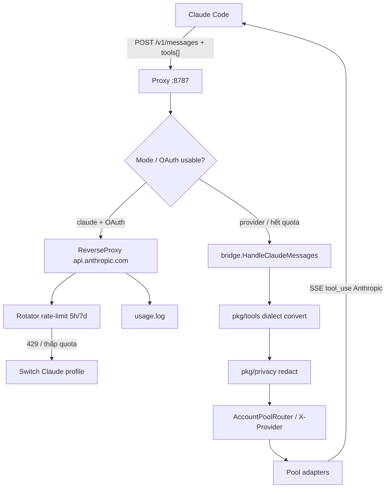

# Kiến Trúc Dự Án `amux` (STRUCT.md)

Dự án `amux` (CLI `am`) theo **Standard Go Project Layout**, kết hợp **DDD** và **Plugin Architecture**.

Tài liệu mô tả cây thư mục, trách nhiệm package, và luồng dữ liệu cốt lõi.

---

## 1. Sơ Đồ Cây Thư Mục

```
amux/
├── main.go                         # Entrypoint mỏng — cli.Run(os.Args)
├── accounts.example.json           # Mẫu providers (ID brand[:method]:NN)
├── STRUCT.md                       # Kiến trúc
├── README.md                       # Hướng dẫn sử dụng
│
└── pkg/
    ├── cli/                        # [ENTRYPOINT] Dispatch lệnh CLI
    │   └── cli.go                  # add/ls/sw/proxy/watch/accounts off|on/...
    │
    ├── types/                      # [DOMAIN CORE] Contracts dùng chung
    │   ├── chat.go                 # ChatMessage, ChatRequest, StreamChunk, ProviderAdapter
    │   ├── profile.go              # ProfileMeta, Artifact, Token…
    │   ├── usage.go                # UsageEntry (+ project/model fields)
    │   ├── config.go               # BaseDir(), ToolConfig
    │   ├── id.go                   # ParseID / FormatID (brand[:method]:NN)
    │   └── account_id.go           # Account identity helpers
    │
    ├── auth/                       # [AUTH] Keychain + OAuth + crypto
    │   ├── keychain.go             # macOS Keychain wrapper
    │   ├── token.go                # Claude OAuth load/refresh
    │   └── crypto.go               # AES-256-GCM / master key
    │
    ├── profile/                    # [PROFILE] Snapshot & switch CLI accounts
    │   ├── manager.go              # CRUD .amp, .meta.json, enabled/disabled
    │   └── transfer.go             # Export/import .amexp
    │
    ├── provider/                   # [PLUGIN] LLM adapters + accounts.json
    │   ├── config.go               # Load/Save, migrate IDs, InRotatePool, LookupAdapter
    │   ├── pool_slot.go            # Slot metadata cho rotate pool
    │   ├── openai.go               # OpenAI-compatible (GitHub, Groq, OpenRouter…)
    │   ├── gemini.go / gemini_web.go
    │   ├── chatgpt_web.go / claude_web.go
    │   ├── codex_cli.go            # Codex CLI token reuse
    │   └── prompt.go / stream.go   # Context concat + SSE helpers
    │
    ├── browser/                    # Cookie / CDP login helpers
    │   ├── cookies.go              # Chromium cookie decrypt (macOS)
    │   ├── cdp_login.go            # Browser login flows
    │   └── claude_account.go       # Claude account extract
    │
    ├── router/                     # [ROUTING] Failover pool
    │   └── pool.go                 # Priority, cooldown 30m, X-Provider lookup
    │
    ├── bridge/                     # [BRIDGE] Protocol convert + routing headers
    │   ├── openai.go               # /v1/chat/completions + /v1/models
    │   ├── claude.go               # /v1/messages ↔ canonical
    │   ├── gemini.go               # /v1beta/models/... (Antigravity & Gemini native)
    │   ├── headers.go              # X-Provider / X-Model → poolSend
    │   └── requestlog.go           # Request I/O log (privacy-aware)
    │
    ├── privacy/                    # [PRIVACY] Redact secrets outbound
    │   └── redact.go               # Email, keys, webhooks, cards… → samples
    │
    ├── tools/                      # [MID-LAYER] Tool dialect convert
    │   ├── dialect.go              # Canonical tool types
    │   ├── claude.go / openai.go   # Anthropic ↔ OpenAI wire
    │   ├── cursor.go / codex.go    # IDE dialects
    │   └── gemini.go               # Gemini functionDeclarations
    │
    ├── utils/                      # Schema helpers dùng chung tools/bridge
    │   └── schema.go
    │
    ├── proxy/                      # [PROXY DAEMON] :8787 gateway
    │   ├── server.go               # HTTP server, routes, middleware
    │   ├── rotator.go              # Claude OAuth rotate + rate-limit 5h/7d
    │   ├── bind.go / client.go     # Bind + daemon control
    │   ├── lifecycle.go            # Claude tab PID watch
    │   ├── supervisor.go           # Watchdog / degraded fallback
    │   └── passthrough.go          # Anthropic reverse-proxy path
    │
    ├── monitor/                    # [OBSERVABILITY] Events + request store
    │   ├── store.go                # Ring buffer / query cho watch UI
    │   └── sink.go                 # Event sink writers
    │
    ├── usage/                      # [METRICS] Token capture & report
    │   ├── capture.go              # Tee reader → ~/.am/usage.log
    │   ├── project.go              # Resolve project từ client port
    │   └── usage.go                # Aggregate day/week/month
    │
    ├── term/                       # [TUI KIT] Lip Gloss / Tokyo Night
    │   ├── style.go / panel.go     # Colors, rounded panels
    │   ├── log.go / logo.go        # Log styles + brand mark
    │
    ├── hook/                       # Claude Code hooks + auto-update
    │   ├── hook.go / feedback.go
    │   └── autoupdate.go
    │
    ├── env/                        # eval "$(am env)" exports
    │   └── env.go
    │
    └── ui/                         # [PRESENTATION] Interactive TUI
        ├── picker.go               # Arrow menu profile/provider
        ├── chat.go                 # am chat REPL
        ├── login.go                # am login / accounts / api wizards
        ├── status.go               # am status
        ├── watch.go                # am watch orchestrator (4 tabs)
        ├── watch_panels.go         # Dash / Accounts / Activity / Usage views
        ├── watch_styles.go         # Watch-specific styles
        └── watch_util.go           # Format helpers
```

---

## 2. Chi Tiết Trách Nhiệm Các Package

| Package | Tầng | Trách nhiệm chính |
| :--- | :--- | :--- |
| `main.go` & `pkg/cli` | Entrypoint | Dispatch CLI; `accounts off\|on`, `watch`, proxy, login… |
| `pkg/types` | Domain Core | Contracts + ID parse (`brand[:method]:NN`). Không import package nội bộ khác. |
| `pkg/auth` | Auth | Keychain, Claude OAuth refresh, AES-GCM. |
| `pkg/profile` | Profile | Snapshot `.amp`, enable/disable profile khỏi rotate. |
| `pkg/provider` | Plugin | Adapters + `accounts.json`; migrate legacy ID; `LoadAccounts` vs `LoadAllAddressable`. |
| `pkg/browser` | Infra | Cookie decrypt + CDP login. |
| `pkg/router` | Router | Priority failover, cooldown 429, explicit provider by ID. |
| `pkg/bridge` | Bridge | Anthropic ↔ OpenAI; `X-Provider`/`X-Model`; request log. |
| `pkg/privacy` | Privacy | Redact secrets trên payload trước upstream. |
| `pkg/tools` | Mid-layer | Tool schema / tool_call dialect (Claude, Cursor, Codex, Gemini). |
| `pkg/utils` | Shared | JSON schema helpers cho tools. |
| `pkg/proxy` | Gateway | Daemon `:8787`, rotator, supervisor, Anthropic passthrough. |
| `pkg/monitor` | Observability | Event/request store phục vụ `am watch`. |
| `pkg/usage` | Metrics | Token capture + báo cáo. |
| `pkg/term` | TUI kit | Style/panel/log dùng chung status + watch. |
| `pkg/hook` / `pkg/env` | Integration | Claude hooks, auto-update, shell env export. |
| `pkg/ui` | Presentation | picker, chat, login, status, **watch** (4 tabs). |

---

## 3. Các Luồng Dữ Liệu Cốt Lõi

### Luồng 1: OpenAI Gateway (`/v1/chat/completions`)



### Luồng 2: Claude Code (`/v1/messages`) + tools



### Luồng 3: Account off/on

1. Login mặc định → **POOL** (rotate).
2. `am accounts off <id>` → `Enabled:false` → **OUT** (không vào failover).
3. Client vẫn gọi: header `X-Provider: <id>` (+ optional `X-Model`).
4. `am accounts on <id>` → vào lại pool. Restart proxy sau đổi pool nếu daemon đang chạy.

---

## 4. Nguyên Tắc Khi Mở Rộng

1. **Zero circular deps:** `pkg/types` là lõi; không import ngược.
2. **Stateless session retention:** Provider mới phải dùng `BuildConcatenatedPrompt` (hoặc tương đương) khi failover.
3. **Graceful failover:** 429 / auth lỗi → `ErrRateLimitReached` / `ErrAuthentication`.
4. **Entrypoint đơn:** chỉ `main.go` → `cli.Run`.
5. **Privacy first:** payload lên upstream đi qua redact; test không chứa literal secret dạng webhook thật (tránh push protection).
6. **ID ổn định:** ID mới = `brand[:method]:NN`; thêm prefix qua `MigrateLegacyIDs`, không invent format song song.
